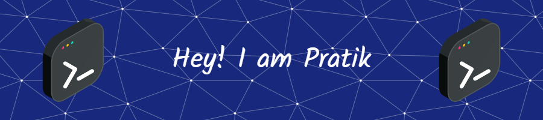

<h3 align="center">A passionate Frontend and AI developer from India</h3>

- 🔭 I’m currently working on **AI/ML**

- 🌱 I’m currently learning **React Js, Data Science**

- 👯 I’m looking to collaborate on **Frontend Web Development**

- 📫 How to reach me **pratik.devnal@gmail.com**

  

  

<h3 align="left">Languages and Tools:</h3>

 

 

 

 
 
 
 </a> 

 
 
<a href="https://www.tensorflow.org" target="_blank" rel="noreferrer">

&nbsp;

<h3 align="left">Connect with me:</h3>

